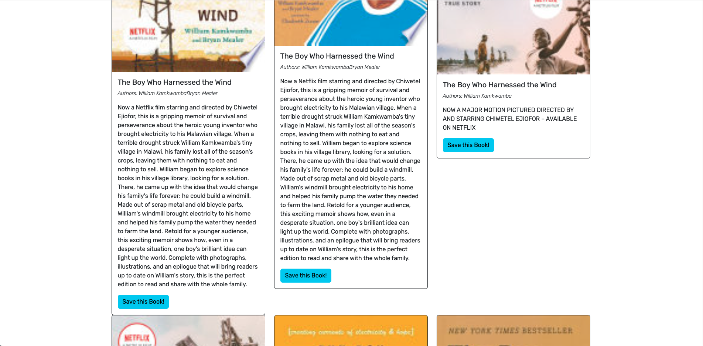

# MERN-Book-Seach-Engine
[](https://opensource.org/licenses/MIT) <br/>
https://github.com/rickybehrens/MERN-Book-Seach-Engine <br/>
https://enchanting-souffle-bf59b8.netlify.app/


## Project Description
This app is a fully functioning Google Books API search engine with a GraphQL API built with Apollo Server. 

## Table of Contents
- [Installation](#installation)
- [Usage](#usage)
- [License](#license)
- [Contributing](#contributing)
- [Questions](#questions)
- [Screenshots](#screenshots)
  
## Installation
To install necessary dependencies, run the following command:
```
npm i
```

  
## Usage
The project is a great book search engine that uses a Google Books API. The app lets the user search for books and once the user is logged in, it allows to save the desired book by clicking on the "save this book" button. The user can access their saved books with the link on the topand there, the user is allowed to delete the books he will no longer desire.

  
## License
This project is licensed under the MIT license.


Copyright (c) 2023 Ricardo Behrens. All rights reserved.


Permission is hereby granted, free of charge, to any person obtaining a copy of this software and associated documentation files (the "Software"), to deal in the Software without restriction, including without limitation the rights to use, copy, modify, merge, publish, distribute, sublicense, and/or sell copies of the Software, and to permit persons to whom the Software is furnished to do so, subject to the following conditions:

The above copyright notice and this permission notice shall be included in all copies or substantial portions of the Software.

THE SOFTWARE IS PROVIDED "AS IS", WITHOUT WARRANTY OF ANY KIND, EXPRESS OR IMPLIED, INCLUDING BUT NOT LIMITED TO THE WARRANTIES OF MERCHANTABILITY, FITNESS FOR A PARTICULAR PURPOSE AND NONINFRINGEMENT. IN NO EVENT SHALL THE AUTHORS OR COPYRIGHT HOLDERS BE LIABLE FOR ANY CLAIM, DAMAGES OR OTHER LIABILITY, WHETHER IN AN ACTION OF CONTRACT, TORT OR OTHERWISE, ARISING FROM, OUT OF OR IN CONNECTION WITH THE SOFTWARE OR THE USE OR OTHER DEALINGS IN THE SOFTWARE.
  
    
## Contributing
If you would like to contribute to this project, please go to the #questions section and contact me directly.

  
## Questions
If you have any questions about the repo, open an issue or contact me directly at [behrensricardo@gmail.com](mailto:behrensricardo@gmail.com). You can find more of my work at [rickybehrens](https://github.com/rickybehrens).

## Screenshots
<!-- Add screenshots here -->





